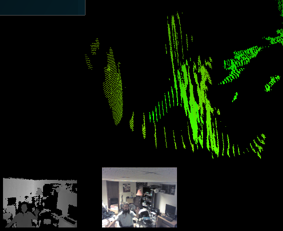
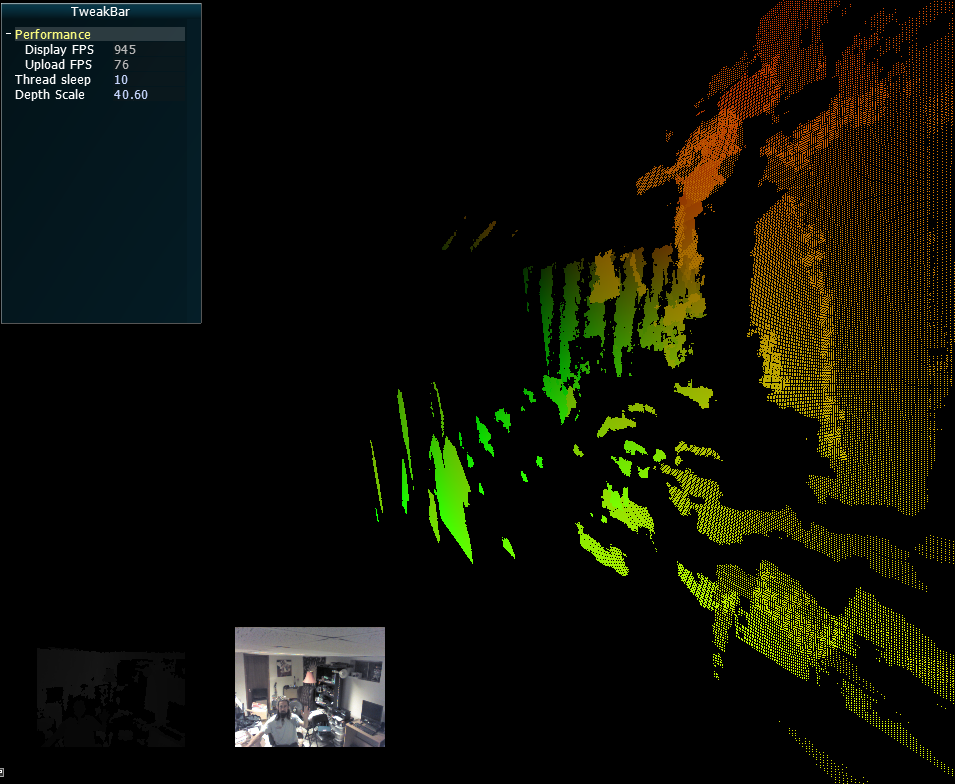
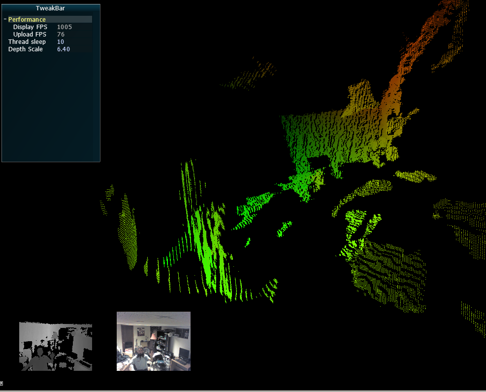
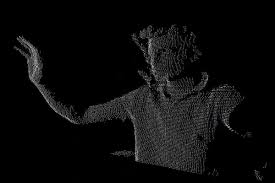
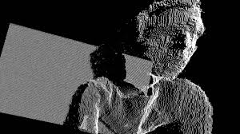
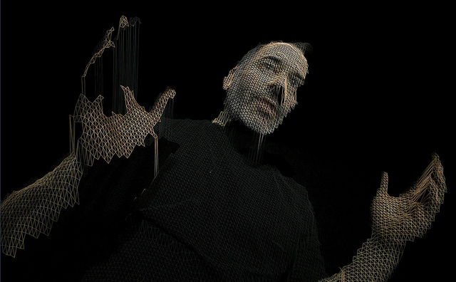

## Point Clouds in OpenGL

### Objective: To use OpenGL for displaying live streamed point cloud data from the Kinect

The Kinect depth map is loaded into GL in a thread with a context that shares data with the main display thread. This appears to be an optimal solution for streaming data to the GPU.

From there, a vertex shader runs on a planar grid of points stored in a VBO within a VAO, its dimensions matching the depth image. The vertex shader uses the **textureLod()** function to fetch data directly from the depth texture and places the points in space by assigning their z value to the fetched texel(with an adjustable uniform scale value).

So far, everything appears optimal speed-wise and seems much more efficient than calling the function **NuiTransformDepthImageToSkeleton()** in a loop on the CPU.

### Problem: It looks like garbage

  

The depth values appear to show serious banding, as though there aren't enough discrete levels of depth to capture nuanced shapes like the human face. Then how do all the videos of point clouds online look so good?

### The relevant source snippets:

#### Declaration of our depth buffer:

    std::vector<unsigned short> m_depthBuffer;

#### Copying data from the Kinect SDK into the buffer:  
This code is copied right out of the Kinect SDK examples.

    // Lock the frame data so the Kinect knows not to modify it while we're reading it
    pTexture->LockRect(0, &LockedRect, NULL, 0);

    // Make sure we've received valid data
    if (LockedRect.Pitch != 0)
    {
        const NUI_DEPTH_IMAGE_PIXEL * pBufferRun = reinterpret_cast<const NUI_DEPTH_IMAGE_PIXEL *>(LockedRect.pBits);

        // end pixel is start + width*height - 1
        const NUI_DEPTH_IMAGE_PIXEL * pBufferEnd = pBufferRun + (m_depthWidth * m_depthHeight);

        int i = 0;
        while (pBufferRun < pBufferEnd)
        {
            // discard the portion of the depth that contains only the player index
            USHORT depth = pBufferRun->depth;
            m_depthBuffer[i++] = depth;

            // Increment our index into the Kinect's depth buffer
            ++pBufferRun;
        }
    }

    // We're done with the texture so unlock it
    pTexture->UnlockRect(0);

#### Kinect Capture thread:

    const std::vector<unsigned short>& dep = g_pCamera->GetDepthBuffer();
    if (!dep.empty())
    {
        // Texture upload
        glBindTexture(GL_TEXTURE_2D, texd);
        glTexImage2D(GL_TEXTURE_2D, 0, GL_LUMINANCE,
                        g_texDepthw, g_texDepthh, 0,
                        GL_LUMINANCE, GL_UNSIGNED_SHORT,
                        &dep[0]);
        glBindTexture(GL_TEXTURE_2D, 0);
    }

#### Vertex shader:  	
	#version 130
	
	attribute vec3 vPosition;
	
	varying vec2 vfTex;
	
	uniform mat4 mvmtx;
	uniform mat4 prmtx;
	
	uniform sampler2D u_sampDepth;
	
	void main()
	{
	    vec2 ndcPos = vPosition.xy;
	    vec2 in_xy = vec2(0.5) + 0.5*(ndcPos);
	    vfTex = in_xy;
	
	    // This is where the magic should happen - sample the depth texture
	    // directly from the vertex shader and set each point's location
	    // according to its nearest sampled depth value.
	    vec4 texel = textureLod(u_sampDepth, in_xy, 0.0);
	    float depthValue = texel.r;
	
	    vec3 pos = vPosition;
	    pos.z = depthValue;
	    // Push all points of unknown depth away where they shouldn't be visible.
	    if (depthValue == 0.0)
	    {
	        pos = vec3(9999.0);
	    }
	    gl_Position = prmtx * mvmtx * vec4(pos, 1.0);
	}
	

## Results

#### Raw values:
  

#### Values << 3
Shifting left 3 appears to reduce the banding, showing more discrete levels of depth. Are these getting wiped out in the texture upload to OpenGL? They're treated as floats in GLSL where there should be more than enough precision. Playing with parameters to **glTexImage2D()** (format, internalFormat) seems to have no effect.
  

Is the data coming off the Kinect simply of low quality? Is some sort of filtering pass required to smooth out the interstices between levels before placing points?

### What it should look like:

If the raw data is as banded as it looks, how do these guys get it looking like this?  

    
  

### Hardware used:
Intel i7 920  
6 GB RAM  
GTX 285  

### Libraries used:
Kinect for Windows SDK  
OpenNI  
pthreads  
GLM  
Glew  
glfw  
